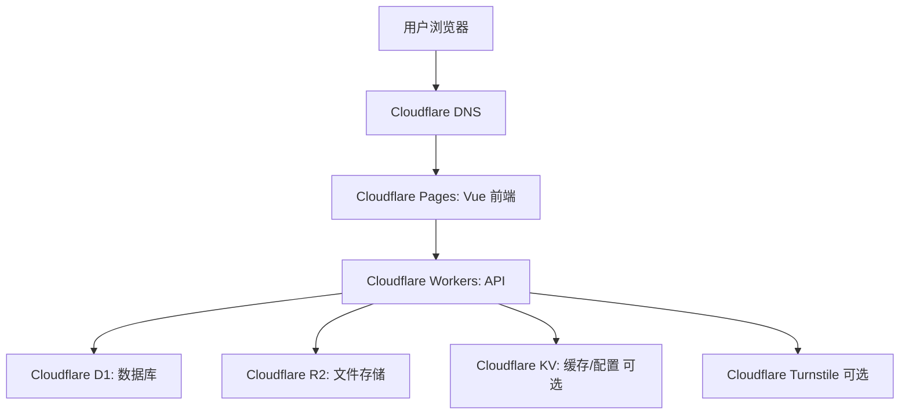

# yun-blog 轻量化重构落地方案：Cloudflare Pages + Workers + D1 + R2

## 0. 当前执行状态

更新时间：2026-05-24

已完成阶段：

- [x] 1. 新建独立项目目录：`D:\project\zed\cloud-blog-lite`
- [x] 2. 初始化 `pnpm workspace`
- [x] 3. 初始化 Vue 3 前端骨架
- [x] 4. 初始化 Cloudflare Worker
- [x] 5. 创建 D1/R2 项目侧配置
- [x] 6. 初始化 admin 用户能力
- [x] 7. 实现登录
- [x] 8. 实现前端主题切换和基础视觉优化
- [x] 9. 实现分类管理
- [x] 10. 实现站点管理
- [x] 11. 实现前台导航页接入真实数据
- [x] 12. 实现上传
- [x] 13. 系统设置和日志完善
- [x] 14. 实现用户管理
- [x] 15. 项目名称更新为 `cloud-blog-lite`

已创建的关键文件：

```text
D:\project\zed\cloud-blog-lite\package.json
D:\project\zed\cloud-blog-lite\pnpm-workspace.yaml
D:\project\zed\cloud-blog-lite\README.md
D:\project\zed\cloud-blog-lite\apps\web\package.json
D:\project\zed\cloud-blog-lite\apps\web\index.html
D:\project\zed\cloud-blog-lite\apps\web\vite.config.ts
D:\project\zed\cloud-blog-lite\apps\web\tsconfig.json
D:\project\zed\cloud-blog-lite\apps\web\src\main.ts
D:\project\zed\cloud-blog-lite\apps\web\src\App.vue
D:\project\zed\cloud-blog-lite\apps\web\src\router\index.ts
D:\project\zed\cloud-blog-lite\apps\web\src\api\http.ts
D:\project\zed\cloud-blog-lite\apps\web\src\stores\auth.ts
D:\project\zed\cloud-blog-lite\apps\web\src\layouts\AdminLayout.vue
D:\project\zed\cloud-blog-lite\apps\web\src\views\public\Navigation.vue
D:\project\zed\cloud-blog-lite\apps\web\src\views\auth\Login.vue
D:\project\zed\cloud-blog-lite\apps\web\src\views\admin\Dashboard.vue
D:\project\zed\cloud-blog-lite\apps\web\src\views\admin\CategoryList.vue
D:\project\zed\cloud-blog-lite\apps\web\src\views\admin\SiteList.vue
D:\project\zed\cloud-blog-lite\apps\web\src\views\admin\UserList.vue
D:\project\zed\cloud-blog-lite\apps\web\src\views\admin\Setting.vue
D:\project\zed\cloud-blog-lite\apps\web\src\styles\main.css
D:\project\zed\cloud-blog-lite\packages\shared\package.json
D:\project\zed\cloud-blog-lite\packages\shared\src\index.ts
D:\project\zed\cloud-blog-lite\apps\worker\package.json
D:\project\zed\cloud-blog-lite\apps\worker\tsconfig.json
D:\project\zed\cloud-blog-lite\apps\worker\wrangler.toml
D:\project\zed\cloud-blog-lite\apps\worker\src\index.ts
D:\project\zed\cloud-blog-lite\apps\worker\src\env.ts
D:\project\zed\cloud-blog-lite\apps\worker\src\utils\response.ts
D:\project\zed\cloud-blog-lite\apps\worker\src\middleware\error.ts
D:\project\zed\cloud-blog-lite\apps\worker\migrations\0001_initial.sql
D:\project\zed\cloud-blog-lite\apps\worker\src\db\client.ts
D:\project\zed\cloud-blog-lite\apps\worker\src\modules\debug\routes.ts
D:\project\zed\cloud-blog-lite\apps\worker\src\modules\setup\routes.ts
D:\project\zed\cloud-blog-lite\apps\worker\src\utils\crypto.ts
D:\project\zed\cloud-blog-lite\apps\worker\src\utils\id.ts
D:\project\zed\cloud-blog-lite\apps\worker\src\modules\auth\routes.ts
D:\project\zed\cloud-blog-lite\apps\worker\src\utils\jwt.ts
D:\project\zed\cloud-blog-lite\apps\worker\src\utils\cookie.ts
D:\project\zed\cloud-blog-lite\apps\web\src\vite-env.d.ts
D:\project\zed\cloud-blog-lite\apps\web\src\stores\theme.ts
D:\project\zed\cloud-blog-lite\apps\web\src\components\ThemeSwitch.vue
D:\project\zed\cloud-blog-lite\apps\web\src\components\SiteCard.vue
D:\project\zed\cloud-blog-lite\apps\web\src\components\PageHeader.vue
D:\project\zed\cloud-blog-lite\apps\worker\src\middleware\auth.ts
D:\project\zed\cloud-blog-lite\apps\worker\src\modules\category\routes.ts
D:\project\zed\cloud-blog-lite\apps\web\src\api\categories.ts
D:\project\zed\cloud-blog-lite\apps\worker\src\modules\site\routes.ts
D:\project\zed\cloud-blog-lite\apps\worker\src\modules\public\routes.ts
D:\project\zed\cloud-blog-lite\apps\web\src\api\sites.ts
D:\project\zed\cloud-blog-lite\apps\web\src\api\public.ts
D:\project\zed\cloud-blog-lite\apps\worker\src\modules\upload\routes.ts
D:\project\zed\cloud-blog-lite\apps\worker\src\modules\setting\routes.ts
D:\project\zed\cloud-blog-lite\apps\worker\src\modules\log\routes.ts
D:\project\zed\cloud-blog-lite\apps\worker\src\utils\log.ts
D:\project\zed\cloud-blog-lite\apps\web\src\api\upload.ts
D:\project\zed\cloud-blog-lite\apps\web\src\api\settings.ts
D:\project\zed\cloud-blog-lite\apps\web\src\api\logs.ts
D:\project\zed\cloud-blog-lite\apps\web\src\views\admin\LogList.vue
D:\project\zed\cloud-blog-lite\apps\worker\src\middleware\role.ts
D:\project\zed\cloud-blog-lite\apps\worker\src\modules\user\routes.ts
D:\project\zed\cloud-blog-lite\apps\web\src\api\users.ts
D:\project\zed\cloud-blog-lite\apps\worker\src\modules\dashboard\routes.ts
D:\project\zed\cloud-blog-lite\apps\web\src\api\dashboard.ts
```

当前前端骨架包含：

- Vue 3 + Vite + TypeScript 配置；
- Vue Router 路由；
- Pinia 登录状态 Store；
- Axios HTTP 客户端封装；
- Naive UI 基础接入；
- 白色/暗黑主题切换；
- 主题选择持久化到 `localStorage`；
- 前台导航页视觉优化；
- 登录页；
- 后台布局视觉优化；
- 仪表盘、分类管理、站点管理、用户管理、系统设置页面占位。

已追加并完成的前端设计要求：

- 前端支持主题选择；
- 第一版已提供 `白色主题` 和 `暗黑主题`；
- 主题选择已在前台导航页和后台管理页可用；
- 用户选择的主题已持久化到 `localStorage`；
- 后续登录用户系统设置完成后，可考虑同步到用户偏好；
- 页面已完成第一轮视觉优化，不再只是功能占位。

当前 Worker 骨架包含：

- Cloudflare Workers 项目配置；
- Hono Web 框架；
- `wrangler.toml` 基础配置；
- Worker 环境变量类型 `Env`；
- 统一响应工具 `ok/fail`；
- 基础错误处理中间件；
- 健康检查接口：`GET /api/health`；
- D1 绑定配置：`DB`；
- R2 绑定配置：`R2`；
- 本地 D1 建表 migration：`migrations/0001_initial.sql`；
- D1/R2 绑定调试接口：`GET /api/debug/bindings`；
- 初始化状态接口：`GET /api/setup/status`；
- 初始化管理员接口：`POST /api/setup/admin`；
- 登录接口：`POST /api/auth/login`；
- 退出接口：`POST /api/auth/logout`；
- 当前用户接口：`GET /api/auth/me`；
- PBKDF2 密码哈希工具；
- JWT 签名/验证工具；
- HttpOnly Cookie 工具；
- ID/时间工具；
- 根项目脚本：`dev:worker`、`deploy:worker`、`typecheck:worker`、`d1:migrate:local`、`d1:migrate:remote`；
- 分类管理接口：`GET /api/admin/categories`、`POST /api/admin/categories`、`PUT /api/admin/categories/:id`、`DELETE /api/admin/categories/:id`；
- 站点管理接口：`GET /api/admin/sites`、`POST /api/admin/sites`、`PUT /api/admin/sites/:id`、`DELETE /api/admin/sites/:id`；
- 公开导航接口：`GET /api/public/navigation`；
- 上传接口：`POST /api/admin/upload`；
- 文件访问接口：`GET /api/files/*`；
- 系统设置接口：`GET /api/admin/settings`、`PUT /api/admin/settings`；
- 操作日志接口：`GET /api/admin/operation-logs`、`DELETE /api/admin/operation-logs/cleanup`；
- 用户管理接口：`GET /api/admin/users`、`POST /api/admin/users`、`PUT /api/admin/users/:id`、`POST /api/admin/users/:id/reset-password`、`DELETE /api/admin/users/:id`；
- 仪表盘统计接口：`GET /api/admin/dashboard/stats`；
- 后台接口鉴权中间件：`authMiddleware`；
- 后台角色限制中间件：`requireRole`。

验证情况：

- 已完成项目名称变更：项目名称已更新为 `cloud-blog-lite`，并同步更新源码、配置、构建产物和文档引用；
- 已通过 `find` 检查项目文件已生成；
- 已执行 `pnpm -C ../cloud-blog-lite install` 安装依赖；
- 已将 Worker 的 `wrangler` 升级到 `^4.94.0`，并将本地开发脚本调整为 `wrangler dev --local --port 8787`；
- 已执行 `pnpm -C ../cloud-blog-lite --filter @cloud-blog-lite/worker typecheck`，类型检查通过；
- 已实现 admin 初始化接口，并已通过本地接口创建 admin 用户；
- 已实现登录/退出/当前用户接口；
- 已通过本地接口验证 `POST /api/auth/login` 可成功登录并设置 `HttpOnly Cookie`；
- 已通过本地接口验证 `GET /api/auth/me` 可通过 Cookie 获取当前用户；
- 已执行 `pnpm -C ../cloud-blog-lite --filter @cloud-blog-lite/worker typecheck`，类型检查通过；
- 已执行 `pnpm -C ../cloud-blog-lite --filter @cloud-blog-lite/web build`，前端构建通过；
- 第 8 步完成后再次执行 `pnpm -C ../cloud-blog-lite --filter @cloud-blog-lite/web build`，前端构建通过；
- 第 9 步完成后执行 `pnpm -C ../cloud-blog-lite --filter @cloud-blog-lite/worker typecheck`，Worker 类型检查通过；
- 第 9 步完成后执行 `pnpm -C ../cloud-blog-lite --filter @cloud-blog-lite/web build`，前端构建通过；
- 已通过本地接口验证分类新增、列表查询和删除流程；
- 第 10/11 步完成后执行 `pnpm -C ../cloud-blog-lite --filter @cloud-blog-lite/worker typecheck`，Worker 类型检查通过；
- 第 10/11 步完成后执行 `pnpm -C ../cloud-blog-lite --filter @cloud-blog-lite/web build`，前端构建通过；
- 已通过本地接口验证站点新增、公开导航查询、站点删除、分类删除流程；
- 第 12/13 步完成后执行 `pnpm -C ../cloud-blog-lite --filter @cloud-blog-lite/worker typecheck`，Worker 类型检查通过；
- 第 12/13 步完成后执行 `pnpm -C ../cloud-blog-lite --filter @cloud-blog-lite/web build`，前端构建通过；
- 已通过本地接口验证设置读取/保存和操作日志查询；
- 已通过本地接口验证 R2 本地上传流程；
- 第 14 步完成后执行 `pnpm -C ../cloud-blog-lite --filter @cloud-blog-lite/worker typecheck`，Worker 类型检查通过；
- 第 14 步完成后执行 `pnpm -C ../cloud-blog-lite --filter @cloud-blog-lite/web build`，前端构建通过；
- 已通过本地接口验证用户新增、编辑、重置密码、删除流程；
- 已补齐仪表盘真实统计接口和前端展示；
- 已为站点管理增加后台私密账号/密码字段：`account`、`password_cipher`；
- 站点密码使用 AES-GCM 加密存储，后台接口解密后返回给已登录后台用户，前台公开导航接口不返回账号/密码；
- 站点管理页支持账号、密码、URL 复制，密码默认敏感显示，可点击显示/隐藏；
- 非管理员角色已隐藏 `用户管理`、`系统设置`、`操作日志` 菜单；
- 已压缩 Modal 表单上下间距，减少表单留白；
- 仪表盘/表单优化后执行 `pnpm -C ../cloud-blog-lite --filter @cloud-blog-lite/worker typecheck`，Worker 类型检查通过；
- 仪表盘/表单优化后执行 `pnpm -C ../cloud-blog-lite --filter @cloud-blog-lite/web build`，前端构建通过；
- 站点账号/密码和菜单权限调整后执行 `pnpm -C ../cloud-blog-lite --filter @cloud-blog-lite/worker typecheck`，Worker 类型检查通过；
- 站点账号/密码和菜单权限调整后执行 `pnpm -C ../cloud-blog-lite --filter @cloud-blog-lite/web build`，前端构建通过；
- 已通过本地接口验证后台站点列表返回明文账号/密码，公开导航接口不返回账号/密码；
- 已执行 `pnpm -C ../cloud-blog-lite --filter @cloud-blog-lite/worker exec wrangler d1 migrations apply cloud-blog-lite --local`，本地 D1 migration 执行成功，18 条 SQL 命令成功；
- 已执行 `pnpm --filter @cloud-blog-lite/worker exec wrangler whoami`，确认 Wrangler 已登录 Cloudflare，账号邮箱为 `***@***.com`，具备 Workers、D1、Pages、R2 等相关权限；
- 已在 Cloudflare 创建远程 D1 数据库 `cloud-blog-lite`，并将 `apps/worker/wrangler.toml` 的 `database_id` 更新为 `<D1_DATABASE_ID>`；
- 已执行 `pnpm --filter @cloud-blog-lite/worker exec wrangler r2 bucket list`，确认远程 R2 Bucket `cloud-blog-lite-files` 已创建；
- 已通过 `wrangler secret put JWT_SECRET` 配置生产环境 JWT 签名密钥，密钥由本地随机生成且未写入仓库；
- 已通过 `wrangler secret put SITE_SECRET` 配置生产环境站点密码加密密钥，密钥由本地随机生成且未写入仓库；
- 已按用户要求重新生成并覆盖生产环境 `JWT_SECRET` 与 `SITE_SECRET`，明文仅交给用户保存，未写入仓库或文档；
- 已执行 `pnpm d1:migrate:remote`，远程 D1 数据库 `cloud-blog-lite` 成功应用 `0001_initial.sql`，共执行 18 条 SQL 命令；
- 已修正根项目 `deploy:worker` 脚本为 `pnpm --filter @cloud-blog-lite/worker run deploy`，避免 pnpm 9 内置 `deploy` 命令冲突；
- 已执行 `pnpm deploy:worker` 部署 Worker 成功，线上地址为 `https://***.com`，版本 ID 为 `<WORKER_VERSION_ID>`；
- 已验证 Worker 健康检查接口 `https://***.com/api/health` 返回 `status: UP`；
- 已执行 `pnpm build:web`，前端构建通过；
- 已创建 Cloudflare Pages 项目 `cloud-blog-lite`，并执行 `wrangler pages deploy ../web/dist --project-name cloud-blog-lite --branch main --commit-dirty=true` 部署前端成功，预览地址为 `https://***.com`；
- 已确认域名 `***.com` 已接入 Cloudflare DNS；
- 已将访问域名规划调整为子域名 `blog.***.com`；
- 已在 `apps/worker/wrangler.toml` 配置 Worker Route `blog.***.com/api/*`，并重新执行 `pnpm deploy:worker` 部署成功，版本 ID 为 `<WORKER_VERSION_ID>`；
- 待 Cloudflare Pages 绑定 `blog.***.com` 并完成 DNS/证书签发后，再验证 `https://blog.***.com/api/health`；
- 已验证 `https://blog.***.com` 返回 `200 OK`，`https://blog.***.com/api/health` 返回 `status: UP`；
- 已通过 `POST /api/setup/admin` 初始化线上管理员账号，并验证 `GET /api/setup/status` 返回 `initialized: true`；
- 已由用户在浏览器验证 `https://blog.***.com/login` 可成功登录，并进入后台用户管理页，确认 HTTPS、Cookie、前后端同域 API 正常；
- 已实现管理员手动备份接口 `POST /api/admin/backups/run`，用于导出 D1 核心表并生成 gzip 压缩备份；
- 已实现 D1 核心表备份上传到 R2，备份路径为 `backups/d1/daily/YYYY-MM-DD/*.json.gz`；
- 已实现 R2 对象清单快照，备份 JSON 中包含 `r2_objects`；
- 已配置 Cloudflare Cron Trigger `0 17 * * *`，对应北京时间每天凌晨 01:00 自动备份；
- 已预留通过 Resend API 将 gzip 备份附件发送到 `***@***.com`，待配置 `RESEND_API_KEY` 和 `BACKUP_EMAIL_FROM` 后启用；
- 已配置 `RESEND_API_KEY` 为 Cloudflare Worker Secret，并配置 `BACKUP_EMAIL_FROM` 为 `cloud-blog-lite <backup@***.com>`；
- 已重新执行 `pnpm deploy:worker` 使邮件配置生效，版本 ID 为 `<WORKER_VERSION_ID>`；
- 已由用户手动触发备份验证邮件发送，接口返回 `email.enabled: true` 且 `email.sent: true`，确认 Resend API 已接收发往 `***@***.com` 的压缩备份邮件发送请求，实际投递状态需以 Resend 日志和 QQ 邮箱收件情况为准；
- 已新增备份与恢复文档 `docs/backup-and-restore.md`；
- 已执行 `pnpm typecheck:worker`，Worker 类型检查通过；
- 已执行 `pnpm deploy:worker` 部署备份功能成功，版本 ID 为 `<WORKER_VERSION_ID>`；
- 已由用户在浏览器控制台手动调用 `POST /api/admin/backups/run`，返回 `code: 0` 且 `data.ok: true`；
- 已在 Cloudflare R2 `cloud-blog-lite-files/backups/d1/daily/2026-05-24/` 确认生成压缩备份文件 `cloud-blog-lite-d1-2026-05-24T12-10-14Z.json.gz`；
- 如本地启动 Worker 出现 `workerd/Miniflare access violation`，优先确认已重新执行 `pnpm install` 并使用新版 Wrangler；
- 如果新版 Wrangler 仍然报 `There was an access violation in the runtime`，需要安装或更新 Microsoft Visual C++ Redistributable x64。

下一步建议继续执行：

```text
16. 部署到 Cloudflare
17. 绑定域名
18. 实现备份
```

后续执行规则：

- 每次只推进一个明确任务；
- 任务完成后，必须回到本文档更新执行状态；
- 未实际验证通过的任务不得标记为完成；
- 涉及部署、迁移、备份的任务，需要记录执行命令和验证结果；
- 每次文档状态更新后，提交并推送到 GitHub。

待执行任务清单：

- [ ] 16. 部署到 Cloudflare
  - [x] 16.1 登录 Cloudflare Wrangler
  - [x] 16.2 创建远程 D1 数据库
  - [x] 16.3 创建远程 R2 Bucket
  - [x] 16.4 更新 `apps/worker/wrangler.toml` 中的真实 `database_id`
  - [x] 16.5 配置生产环境 `JWT_SECRET`
  - [x] 16.6 配置生产环境 `SITE_SECRET`
  - [x] 16.7 执行远程 D1 migration
  - [x] 16.8 部署 Worker
  - [x] 16.9 部署 Cloudflare Pages 前端
  - [ ] 16.10 验证线上 `/api/health`、登录、后台、前台导航、上传、设置和日志
- [x] 17. 绑定域名
  - [x] 17.1 确认域名已接入 Cloudflare DNS
  - [x] 17.2 Cloudflare Pages 绑定访问域名 `blog.***.com`
  - [x] 17.3 Worker 配置 `/api/*` Route
  - [x] 17.4 验证 HTTPS、Cookie、前后端同域 API
- [ ] 18. 实现备份
  - [x] 18.1 实现或确认 D1 手动导出方式
  - [x] 18.2 实现 D1 备份上传 R2
  - [x] 18.3 配置 Cron Trigger 定时备份
  - [x] 18.4 实现 R2 文件清单备份
  - [x] 18.5 编写恢复文档
  - [ ] 18.6 验证可以从备份恢复核心数据
- [ ] 19. 迁移旧数据
  - [ ] 19.1 解压并确认旧 MySQL 数据
  - [ ] 19.2 编写分类数据迁移脚本
  - [ ] 19.3 编写站点数据迁移脚本
  - [ ] 19.4 编写用户数据迁移脚本或重置密码方案
  - [ ] 19.5 导入远程 D1 并人工核对

本地初始化 admin 的调用方式：

1. 启动 Worker：

```powershell
pnpm dev:worker
```

2. 检查初始化状态：

```powershell
Invoke-RestMethod -Uri "http://localhost:8787/api/setup/status"
```

3. 如果返回 `initialized: false`，创建第一个管理员：

```powershell
Invoke-RestMethod `
  -Uri "http://localhost:8787/api/setup/admin" `
  -Method Post `
  -ContentType "application/json" `
  -Body '{"username":"admin","password":"请替换成至少8位强密码","nickname":"超级管理员"}'
```

注意：

- `POST /api/setup/admin` 仅在 `users` 表为空时可用；
- 一旦创建了第一个用户，再次调用会返回 `403`；
- 密码使用 PBKDF2 + 随机 salt 存储，不复用旧系统 MD5。

表结构对比和调整说明：

- 已根据 `db/blog_20260524_010001.sql` 对旧 MySQL 表和当前 D1 表做对比；
- 对比文档见：`docs/schema-comparison-and-migration.md`；
- 已按对比结论调整 `cloud-blog-lite/apps/worker/migrations/0001_initial.sql`；
- 当前第一版仍保持 5 张核心表，但补充了必要迁移字段：`parent_id`、`level`、`created_by`、`remark`、`login_error_count`、`username`、`description` 等；
- `site.account` 和 `site.password` 包含敏感信息，第一版明确不迁移到公开 `sites` 表。

---

## 1. 目标说明

本方案用于将当前 `yun-blog` 项目重构为一个极轻量、低运维、可绑定自定义域名、无需部署到阿里云 Web 服务的 Cloudflare 架构项目。

核心目标：

- 绑定自定义域名；
- 不将 Web/API 服务部署到阿里云；
- 不依赖传统服务器、JDK、Nginx、PM2；
- 尽量减少后端运维；
- 保留当前项目最核心的导航站/后台管理能力；
- 支持后续备份、迁移和扩展。

最终架构：

```text
Vue 3 前端        -> Cloudflare Pages
API 后端          -> Cloudflare Workers
数据库            -> Cloudflare D1
文件存储          -> Cloudflare R2
缓存/轻配置       -> Cloudflare KV，可选
验证码/人机校验   -> Cloudflare Turnstile，可选
域名 DNS          -> Cloudflare DNS
```

---

## 2. 为什么选择该方案

当前 Java 项目使用：

```text
Spring Boot + FreeMarker + Shiro + MyBatis-Plus + MySQL + Layui/jQuery
```

它适合传统服务器部署，但对于“轻量化 + Cloudflare 部署 + 绑定域名 + 避免阿里云 Web 服务”这个目标来说过重。

本方案重构后：

```text
Vue 3 + Cloudflare Pages + Cloudflare Workers + D1 + R2
```

可以去掉：

- Spring Boot；
- Java/JDK；
- Maven 打包；
- FreeMarker；
- Shiro；
- MyBatis-Plus；
- Druid；
- Ehcache；
- 传统服务器启动脚本；
- 阿里云 ECS/SAE/函数计算 Web 服务。

---

## 3. 总体架构



推荐访问结构：

```text
https://example.com              前端页面
https://example.com/api/*        Worker API
```

建议使用同域 API，而不是 `api.example.com`，原因：

- Cookie 鉴权更简单；
- 不需要额外处理跨域；
- 前端部署和 API 路由更统一。

---

## 4. 技术选型

### 4.1 前端

| 类型 | 技术 |
|---|---|
| 框架 | Vue 3 |
| 构建工具 | Vite |
| 语言 | TypeScript |
| 路由 | Vue Router |
| 状态管理 | Pinia |
| 请求 | ofetch 或 Axios |
| UI | Naive UI，推荐；Element Plus 也可 |
| 样式 | UnoCSS 或 Tailwind CSS |
| 部署 | Cloudflare Pages |

推荐：

```text
Vue 3 + Vite + TypeScript + Pinia + Vue Router + Naive UI + UnoCSS
```

### 4.2 后端

| 类型 | 技术 |
|---|---|
| 运行环境 | Cloudflare Workers |
| Web 框架 | Hono |
| ORM | Drizzle ORM |
| 数据库 | Cloudflare D1 |
| 文件存储 | Cloudflare R2 |
| 鉴权 | JWT + HttpOnly Cookie |
| 密码加密 | bcryptjs 或 Web Crypto PBKDF2 |
| 校验 | zod |
| 部署 | Wrangler |

推荐：

```text
Cloudflare Workers + Hono + Drizzle + D1 + R2
```

## 4.3 前端视觉和主题要求

第一版前端不只是完成 CRUD 页面，还需要保证基础视觉质感。整体风格建议：

```text
简洁
现代
留白充足
卡片化
轻渐变
响应式
适合导航站展示
```

### 4.3.1 主题模式

必须支持两套主题：

| 主题 | 说明 |
|---|---|
| 白色主题 | 默认主题，适合日间浏览 |
| 暗黑主题 | 适合夜间浏览，降低视觉疲劳 |

实现要求：

- 使用 Naive UI 的 `lightTheme` / `darkTheme`；
- 通过 Pinia 或 composable 维护主题状态；
- 主题选择持久化到 `localStorage`；
- 页面刷新后保留上次主题；
- 前台导航页右上角提供主题切换入口；
- 后台管理布局顶部提供主题切换入口；
- 切换主题时页面背景、文字、卡片、边框、按钮状态需要统一变化。

建议状态设计：

```ts
type ThemeMode = 'light' | 'dark'
```

建议本地存储 key：

```text
cloud_blog_theme
```

### 4.3.2 前台导航页设计要求

前台导航页需要比普通后台页面更精致，建议包含：

- 顶部导航栏；
- 站点标题和描述；
- 主题切换按钮；
- 搜索框；
- 分类侧边栏或分类锚点；
- 站点卡片网格；
- 响应式布局；
- 空状态展示；
- 页脚信息。

站点卡片建议包含：

```text
Logo / 图标
站点名称
站点描述
跳转按钮或点击卡片跳转
分类标识，可选
```

视觉建议：

- 白色主题使用浅灰背景和白色卡片；
- 暗黑主题使用深色背景和低对比边框；
- 卡片添加 hover 效果；
- 搜索框突出显示；
- 分类切换需要有选中状态；
- 移动端优先保证可读性。

### 4.3.3 后台页面设计要求

后台管理页建议采用：

```text
左侧菜单 + 顶部栏 + 内容卡片区域
```

要求：

- 顶部栏显示当前页面标题；
- 顶部栏右侧预留主题切换和用户菜单；
- 表格页使用卡片承载筛选区和数据表格；
- 新增/编辑使用 Drawer 或 Modal；
- 删除操作需要二次确认；
- 加载中、空状态、错误状态需要有 UI 反馈；
- 表单字段布局整齐，避免纯功能型页面太粗糙。

### 4.3.4 后续需要新增的前端文件

建议后续补充：

```text
apps/web/src/stores/theme.ts
apps/web/src/components/ThemeSwitch.vue
apps/web/src/components/SiteCard.vue
apps/web/src/components/PageHeader.vue
apps/web/src/composables/useTheme.ts，可选
```

---

## 5. 功能范围

### 5.1 第一版必须实现

第一版只做最小闭环：

```text
1. 前台导航页
2. 登录/退出
3. 当前登录用户信息
4. 分类管理
5. 站点管理
6. 用户管理，简化版
7. 文件上传到 R2
8. 系统设置，简化版
9. D1 数据备份导出
```

### 5.2 第一版暂不迁移

以下功能不进入第一版：

```text
部门管理
员工信息管理
Excel 导入
模板管理
复杂 Shiro 权限
复杂菜单权限
Ehcache 缓存
factory 交易模块
复杂操作日志统计
```

这些功能可以在第一版跑通后再按需恢复。

---

## 6. 新项目目录结构

建议在当前仓库中新建 `cloud-blog-lite` 目录，不直接改动旧 Java 项目。

```text
yun-blog/
├── docs/
│   ├── project-overview-and-refactor.md
│   └── cloudflare-lite-implementation-plan.md
│
└── cloud-blog-lite/
    ├── apps/
    │   ├── web/                       # Vue 前端，部署 Cloudflare Pages
    │   │   ├── src/
    │   │   │   ├── api/               # API 请求封装
    │   │   │   ├── assets/
    │   │   │   ├── components/
    │   │   │   ├── layouts/
    │   │   │   ├── router/
    │   │   │   ├── stores/
    │   │   │   ├── styles/
    │   │   │   ├── types/
    │   │   │   ├── utils/
    │   │   │   └── views/
    │   │   │       ├── public/
    │   │   │       │   └── Navigation.vue
    │   │   │       ├── auth/
    │   │   │       │   └── Login.vue
    │   │   │       └── admin/
    │   │   │           ├── Dashboard.vue
    │   │   │           ├── CategoryList.vue
    │   │   │           ├── SiteList.vue
    │   │   │           ├── UserList.vue
    │   │   │           └── Setting.vue
    │   │   ├── index.html
    │   │   ├── package.json
    │   │   ├── vite.config.ts
    │   │   └── tsconfig.json
    │   │
    │   └── worker/                    # Cloudflare Workers API
    │       ├── src/
    │       │   ├── index.ts           # Worker 入口
    │       │   ├── env.ts             # 环境变量类型
    │       │   ├── db/
    │       │   │   ├── client.ts      # D1/Drizzle 客户端
    │       │   │   └── schema.ts      # 数据库 schema
    │       │   ├── middleware/
    │       │   │   ├── auth.ts        # 登录校验
    │       │   │   ├── error.ts       # 异常处理
    │       │   │   └── logger.ts      # 请求日志
    │       │   ├── modules/
    │       │   │   ├── auth/
    │       │   │   ├── public/
    │       │   │   ├── category/
    │       │   │   ├── site/
    │       │   │   ├── user/
    │       │   │   ├── upload/
    │       │   │   └── setting/
    │       │   └── utils/
    │       │       ├── crypto.ts
    │       │       ├── response.ts
    │       │       └── id.ts
    │       ├── migrations/
    │       ├── drizzle.config.ts
    │       ├── package.json
    │       ├── tsconfig.json
    │       └── wrangler.toml
    │
    ├── packages/
    │   └── shared/
    │       ├── src/
    │       │   ├── types.ts
    │       │   └── constants.ts
    │       ├── package.json
    │       └── tsconfig.json
    │
    ├── package.json
    ├── pnpm-workspace.yaml
    └── README.md
```

---

## 7. 数据库设计：D1

D1 是 SQLite 风格数据库。第一版设计应尽量简单、稳定、便于后续迁移到 MySQL/PostgreSQL。

### 7.1 用户表

```sql
CREATE TABLE users (
  id TEXT PRIMARY KEY,
  username TEXT NOT NULL UNIQUE,
  password_hash TEXT NOT NULL,
  nickname TEXT,
  avatar TEXT,
  role TEXT NOT NULL DEFAULT 'admin',
  status INTEGER NOT NULL DEFAULT 1,
  last_login_at TEXT,
  created_at TEXT NOT NULL,
  updated_at TEXT NOT NULL
);
```

说明：

- `id` 使用字符串 ID，例如 `crypto.randomUUID()`；
- `role` 第一版只做简单角色；
- `status`：`1` 正常，`0` 禁用；
- 密码不要使用 MD5。

### 7.2 分类表

```sql
CREATE TABLE categories (
  id TEXT PRIMARY KEY,
  name TEXT NOT NULL,
  icon TEXT,
  sort INTEGER NOT NULL DEFAULT 0,
  visible INTEGER NOT NULL DEFAULT 1,
  created_at TEXT NOT NULL,
  updated_at TEXT NOT NULL
);

CREATE INDEX idx_categories_sort ON categories(sort);
CREATE INDEX idx_categories_visible ON categories(visible);
```

### 7.3 站点表

```sql
CREATE TABLE sites (
  id TEXT PRIMARY KEY,
  category_id TEXT NOT NULL,
  name TEXT NOT NULL,
  url TEXT NOT NULL,
  description TEXT,
  logo TEXT,
  sort INTEGER NOT NULL DEFAULT 0,
  visible INTEGER NOT NULL DEFAULT 1,
  created_at TEXT NOT NULL,
  updated_at TEXT NOT NULL,
  FOREIGN KEY(category_id) REFERENCES categories(id)
);

CREATE INDEX idx_sites_category_id ON sites(category_id);
CREATE INDEX idx_sites_sort ON sites(sort);
CREATE INDEX idx_sites_visible ON sites(visible);
CREATE INDEX idx_sites_name ON sites(name);
```

### 7.4 系统设置表

```sql
CREATE TABLE settings (
  key TEXT PRIMARY KEY,
  value TEXT,
  updated_at TEXT NOT NULL
);
```

建议配置项：

```text
site.title
site.description
site.logo
site.icp_text，默认空，不展示
site.footer_text
site.allow_register
```

### 7.5 操作日志表，简化版

```sql
CREATE TABLE operation_logs (
  id TEXT PRIMARY KEY,
  user_id TEXT,
  action TEXT NOT NULL,
  module TEXT,
  detail TEXT,
  ip TEXT,
  user_agent TEXT,
  created_at TEXT NOT NULL
);

CREATE INDEX idx_operation_logs_user_id ON operation_logs(user_id);
CREATE INDEX idx_operation_logs_created_at ON operation_logs(created_at);
```

注意：

- 日志表不要无限增长；
- 建议提供定期清理，例如只保留最近 90 天；
- 大量访问日志不要写入 D1，避免写入量过大。

---

## 8. 角色和权限设计

第一版不做复杂 Shiro 权限模型，只做轻量角色。

```text
admin   超级管理员，可以管理所有内容
editor  编辑者，可以管理分类和站点
viewer  只读用户，可选
```

权限规则：

| 功能 | admin | editor | viewer |
|---|---:|---:|---:|
| 查看后台 | 是 | 是 | 是 |
| 分类管理 | 是 | 是 | 否 |
| 站点管理 | 是 | 是 | 否 |
| 用户管理 | 是 | 否 | 否 |
| 系统设置 | 是 | 否 | 否 |
| 文件上传 | 是 | 是 | 否 |
| 操作日志 | 是 | 否 | 否 |

后端必须做权限校验，前端隐藏按钮只是体验优化，不作为安全控制。

---

## 9. API 设计

统一返回结构：

```ts
interface ApiResponse<T> {
  code: number
  message: string
  data: T | null
}
```

约定：

```text
0      成功
400    参数错误
401    未登录
403    无权限
404    数据不存在
429    请求过于频繁
500    服务异常
```

### 9.1 公开接口

```text
GET /api/public/navigation
GET /api/public/categories
GET /api/public/sites
GET /api/public/settings
```

`GET /api/public/navigation` 返回结构建议：

```ts
interface NavigationResponse {
  settings: Record<string, string>
  categories: Array<{
    id: string
    name: string
    icon?: string
    sites: Array<{
      id: string
      name: string
      url: string
      description?: string
      logo?: string
    }>
  }>
}
```

### 9.2 认证接口

```text
POST /api/auth/login
POST /api/auth/logout
GET  /api/auth/me
```

登录请求：

```json
{
  "username": "admin",
  "password": "password"
}
```

登录成功：

- 后端设置 `HttpOnly` Cookie；
- 返回当前用户基础信息；
- 不把 token 暴露给前端 JS。

Cookie 建议：

```text
HttpOnly
Secure
SameSite=Lax
Path=/
Max-Age=604800
```

### 9.3 分类管理

```text
GET    /api/admin/categories
POST   /api/admin/categories
GET    /api/admin/categories/:id
PUT    /api/admin/categories/:id
DELETE /api/admin/categories/:id
```

新增/修改请求：

```json
{
  "name": "开发工具",
  "icon": "code",
  "sort": 10,
  "visible": 1
}
```

删除分类时需要处理：

- 如果分类下存在站点，禁止删除；
- 或提供强制删除参数，第一版建议禁止删除。

### 9.4 站点管理

```text
GET    /api/admin/sites
POST   /api/admin/sites
GET    /api/admin/sites/:id
PUT    /api/admin/sites/:id
DELETE /api/admin/sites/:id
```

查询参数：

```text
categoryId
keyword
visible
page
pageSize
```

新增/修改请求：

```json
{
  "categoryId": "category-id",
  "name": "GitHub",
  "url": "https://***.com",
  "description": "代码托管平台",
  "logo": "https://...",
  "sort": 10,
  "visible": 1
}
```

### 9.5 用户管理

```text
GET    /api/admin/users
POST   /api/admin/users
GET    /api/admin/users/:id
PUT    /api/admin/users/:id
DELETE /api/admin/users/:id
POST   /api/admin/users/:id/reset-password
```

第一版建议限制：

- 只有 `admin` 可以管理用户；
- 禁止删除最后一个 `admin`；
- 禁止当前用户禁用自己；
- 重置密码后要求用户首次登录修改密码，可后续实现。

### 9.6 文件上传

第一版可采用 Worker 代理上传到 R2：

```text
POST /api/admin/upload
```

请求：`multipart/form-data`

返回：

```json
{
  "key": "uploads/2026/05/xxx.png",
  "url": "/api/files/uploads/2026/05/xxx.png"
}
```

文件访问：

```text
GET /api/files/:key
```

注意：

- 限制文件大小；
- 限制文件类型；
- 图片建议限制为 `jpg/jpeg/png/webp/svg/ico`；
- 不要允许任意可执行文件上传。

### 9.7 系统设置

```text
GET /api/admin/settings
PUT /api/admin/settings
```

请求：

```json
{
  "site.title": "云导航",
  "site.description": "我的轻量导航站",
  "site.footer_text": "Powered by Cloudflare"
}
```

### 9.8 操作日志

```text
GET /api/admin/operation-logs
DELETE /api/admin/operation-logs/cleanup
```

清理请求：

```json
{
  "beforeDays": 90
}
```

---

## 10. 认证与安全设计

### 10.1 登录认证

建议使用：

```text
JWT + HttpOnly Cookie
```

流程：

```text
用户登录
  -> 后端校验账号密码
  -> 生成 JWT
  -> 设置 HttpOnly Cookie
  -> 前端通过 /api/auth/me 获取用户信息
```

不要使用：

```text
localStorage 保存 token
sessionStorage 保存 token
明文密码
MD5 密码
```

### 10.2 密码加密

可选方案：

1. `bcryptjs`，实现简单；
2. Web Crypto PBKDF2，适配 Worker 原生能力；
3. 后续需要更高安全性时引入专门支持 Worker 的密码哈希库。

第一版建议：

```text
bcryptjs
```

如果包体和兼容性有问题，再切换到 Web Crypto PBKDF2。

### 10.3 CSRF

如果使用 Cookie 鉴权，需要考虑 CSRF。

建议：

- Cookie 使用 `SameSite=Lax`；
- 管理接口只允许同源请求；
- 对 `POST/PUT/DELETE` 请求校验 `Origin`；
- 后续可增加 CSRF Token。

### 10.4 限流

对以下接口做限流：

```text
POST /api/auth/login
POST /api/admin/upload
/api/admin/*
```

简单实现：

- 使用 KV 记录 IP + 路径的短期计数；
- 或先只对登录接口做内存/请求级限制；
- 后续再完善。

### 10.5 输入校验

后端所有请求使用 `zod` 校验：

- 字符串长度；
- URL 格式；
- 数字范围；
- 枚举值；
- 文件类型。

不要信任前端传参。

---

## 11. 备份方案

### 11.1 D1 备份

必须实现数据库导出备份。

建议两种方式：

#### 方式一：手动导出

开发初期可以使用 Wrangler 导出 SQL。

备份文件命名：

```text
backups/d1/yun-blog-2026-05-24.sql
```

#### 方式二：定时备份，推荐后续实现

使用 Cloudflare Cron Trigger：

```text
每天凌晨 03:00
  -> 读取核心表
  -> 生成 JSON/SQL 备份
  -> 上传到 R2 backups/ 目录
```

建议备份策略：

```text
最近 7 天：每日备份
最近 4 周：每周备份
最近 12 个月：每月备份
```

备份路径：

```text
r2://yun-blog-files/backups/d1/daily/2026-05-24.json
r2://yun-blog-files/backups/d1/weekly/2026-W21.json
r2://yun-blog-files/backups/d1/monthly/2026-05.json
```

### 11.2 R2 文件备份

R2 本身是对象存储，但仍建议：

- 重要文件保留原始 key；
- 不轻易物理删除；
- 删除时先软删除，后续定期清理；
- 可定期导出文件清单。

### 11.3 数据迁移预案

为了未来从 D1 迁移到 MySQL/PostgreSQL，设计时要注意：

- 表结构不要过度依赖 SQLite 特性；
- ID 使用字符串，便于跨库迁移；
- 时间统一 ISO 字符串；
- JSON 字段尽量少用或只用于日志详情；
- 业务 SQL 不写过于复杂的数据库方言。

---

## 12. Cloudflare 资源配置

### 12.1 D1

创建 D1 数据库：

```bash
wrangler d1 create yun-blog
```

`wrangler.toml`：

```toml
[[d1_databases]]
binding = "DB"
database_name = "yun-blog"
database_id = "替换为 Cloudflare 返回的 database_id"
```

### 12.2 R2

创建 R2 Bucket：

```bash
wrangler r2 bucket create yun-blog-files
```

`wrangler.toml`：

```toml
[[r2_buckets]]
binding = "R2"
bucket_name = "yun-blog-files"
```

### 12.3 KV，可选

如果需要限流/缓存：

```bash
wrangler kv namespace create yun-blog-kv
```

`wrangler.toml`：

```toml
[[kv_namespaces]]
binding = "KV"
id = "替换为 namespace id"
```

### 12.4 Worker 环境变量

`wrangler.toml`：

```toml
name = "yun-blog-api"
main = "src/index.ts"
compatibility_date = "2024-06-01"

[vars]
JWT_ISSUER = "yun-blog"
COOKIE_NAME = "cloud_blog_token"
```

敏感变量使用 secret：

```bash
wrangler secret put JWT_SECRET
wrangler secret put SITE_SECRET
```

注意：

- 不要把 `JWT_SECRET` 写入代码仓库；
- 不要把 `SITE_SECRET` 写入代码仓库；
- `JWT_SECRET` 用于登录 JWT 签名；
- `SITE_SECRET` 用于站点账号密码的 AES-GCM 加密/解密；
- 一旦生产环境已有加密后的站点密码，不要随意更换 `SITE_SECRET`，否则旧密码将无法解密；
- 如果必须轮换 `SITE_SECRET`，需要先用旧密钥解密，再用新密钥重新加密。

### 12.5 Windows 本地开发前置依赖

在 Windows 上运行 `wrangler dev --local` 时，Cloudflare 的本地运行时 `workerd` 依赖 Microsoft Visual C++ Redistributable。

如果启动 Worker 时出现：

```text
There was an access violation in the runtime.
On Windows, this may be caused by an outdated Microsoft Visual C++ Redistributable library.
The Workers runtime failed to start.
```

说明本机缺少或安装了过旧的 VC++ 运行库。

处理方式：

1. 安装最新版 Microsoft Visual C++ Redistributable，建议安装 x64 版本；
2. 官方地址：`https://learn.microsoft.com/en-us/cpp/windows/latest-supported-vc-redist`；
3. 安装完成后关闭当前终端，重新打开 PowerShell；
4. 重新执行：

```powershell
pnpm dev:worker
```

也可以使用 winget 安装：

```powershell
winget install Microsoft.VCRedist.2015+.x64
```

如果暂时不想处理本地运行时，也可以尝试远程开发模式：

```powershell
pnpm --filter @cloud-blog-lite/worker dev:remote
```

但远程模式需要先登录 Cloudflare：

```powershell
pnpm --filter @cloud-blog-lite/worker exec wrangler login
```

---

## 13. 域名绑定方案

假设域名为：

```text
example.com
```

建议配置：

```text
example.com         -> Cloudflare Pages
www.example.com     -> Cloudflare Pages
example.com/api/*   -> Cloudflare Worker Route
```

部署完成后：

```text
https://example.com
https://example.com/api/public/navigation
```

### 13.1 DNS

将域名 NS 修改为 Cloudflare 提供的 Nameserver。

然后在 Cloudflare 中管理解析。

### 13.2 Pages 绑定域名

Cloudflare Pages 项目中添加：

```text
example.com
www.example.com
```

### 13.3 Worker 绑定路由

Worker Routes 添加：

```text
example.com/api/*
```

注意：Worker 路由优先级要覆盖 Pages 的 `/api/*` 请求。

---

## 14. 开发阶段计划

### 阶段 0：准备工作

目标：完成技术准备和项目骨架。

任务：

```text
1. 安装 Node.js 20+
2. 安装 pnpm
3. 安装 wrangler
4. 登录 Cloudflare
5. 新建 cloud-blog-lite monorepo
6. 初始化 web 和 worker
7. 创建 D1、R2
8. 配置 wrangler.toml
```

验收：

```text
pnpm install 成功
web 可以本地启动
worker 可以本地启动
worker 可以访问 D1
```

### 阶段 1：数据库和基础 API

任务：

```text
1. 编写 D1 migrations
2. 实现 Drizzle schema
3. 实现统一响应结构
4. 实现全局异常处理
5. 实现 /api/health
6. 初始化管理员账号脚本
```

验收：

```text
GET /api/health 返回正常
D1 表创建成功
可以创建初始 admin 用户
```

### 阶段 2：认证模块

任务：

```text
1. 实现登录接口
2. 实现 logout
3. 实现 /api/auth/me
4. 实现 auth middleware
5. 实现 role middleware
6. 前端登录页
7. 前端登录状态维护
```

验收：

```text
可以登录
刷新页面仍保持登录
退出后无法访问后台接口
非 admin 不能访问用户管理
```

### 阶段 2.5：前端主题和基础视觉优化

任务：

```text
1. 新增 theme store
2. 接入 Naive UI lightTheme/darkTheme
3. 实现 ThemeSwitch 组件
4. 前台导航页增加主题切换入口
5. 后台顶部栏增加主题切换入口
6. 使用 CSS 变量统一背景、文字、卡片、边框颜色
7. 优化首页视觉：hero 区域、搜索框、站点卡片、分类导航
8. 优化后台视觉：顶部栏、侧边栏、内容卡片
9. 将主题选择保存到 localStorage
```

验收：

```text
可以在白色主题和暗黑主题之间切换
刷新页面后保留主题选择
前台和后台主题表现一致
首页视觉效果不只是功能占位
后台页面具备基础管理系统质感
```

### 阶段 3：分类管理

任务：

```text
1. 分类 CRUD API
2. 分类列表页面
3. 分类新增/编辑弹窗
4. 分类删除保护
5. 分类排序
```

验收：

```text
后台可以维护分类
前台可以读取可见分类
```

### 阶段 4：站点管理

任务：

```text
1. 站点 CRUD API
2. 分页查询
3. 关键词搜索
4. 按分类筛选
5. 前端站点列表页面
6. 新增/编辑站点表单
```

验收：

```text
后台可以维护站点
前台导航页可以展示站点
```

### 阶段 5：前台导航页

任务：

```text
1. 实现 /api/public/navigation
2. 实现导航页布局
3. 实现分类导航
4. 实现站点搜索
5. 实现响应式布局
6. 实现系统标题/描述配置读取
```

验收：

```text
访问首页可以看到导航页
分类和站点按排序展示
搜索可用
移动端布局可用
```

### 阶段 6：文件上传

任务：

```text
1. 实现 R2 上传接口
2. 限制文件类型
3. 限制文件大小
4. 实现文件访问接口
5. 分类/站点 logo 支持上传
```

验收：

```text
可以上传图片
上传后的图片可在前台展示
非法文件被拒绝
```

### 阶段 7：设置和日志

任务：

```text
1. 系统设置 API
2. 设置页面
3. 操作日志记录
4. 操作日志列表
5. 日志清理接口
```

验收：

```text
后台可修改站点标题等配置
关键操作能记录日志
可以清理旧日志
```

### 阶段 8：部署和域名

任务：

```text
1. 部署 Worker
2. 部署 Pages
3. 绑定域名
4. 配置 Worker Route: /api/*
5. 配置 JWT_SECRET
6. 验证 HTTPS
7. 验证登录 Cookie
```

验收：

```text
https://example.com 可访问
https://example.com/api/health 可访问
登录、后台、前台全部正常
```

### 阶段 9：备份

任务：

```text
1. 实现手动导出接口，仅 admin
2. 实现 D1 数据导出脚本
3. 实现备份上传 R2
4. 配置 Cron Trigger，每日备份
5. 写恢复文档
```

验收：

```text
R2 中每天生成备份文件
可以从备份文件恢复核心数据
```

---

## 15. 本地开发命令建议

根目录：

```bash
pnpm install
```

前端：

```bash
pnpm --filter web dev
pnpm --filter web build
```

Worker：

```bash
pnpm --filter worker dev
pnpm --filter worker deploy
```

D1 migration：

```bash
wrangler d1 migrations apply yun-blog --local
wrangler d1 migrations apply yun-blog --remote
```

查看 D1：

```bash
wrangler d1 execute yun-blog --command "SELECT * FROM users"
```

---

## 16. 部署配置建议

### 16.1 Cloudflare Pages

构建配置：

```text
Build command: pnpm --filter web build
Build output directory: apps/web/dist
Root directory: cloud-blog-lite，可按仓库实际情况调整
```

环境变量：

```text
VITE_API_BASE=/api
```

### 16.2 Cloudflare Worker

部署：

```bash
pnpm --filter worker deploy
```

Route：

```text
example.com/api/*
```

Secrets：

```bash
wrangler secret put JWT_SECRET
```

---

## 17. 数据从旧项目迁移

旧项目数据库压缩包位于：

```text
db/blog.rar
```

迁移步骤：

```text
1. 解压 blog.rar
2. 确认原 MySQL 表结构
3. 导出核心数据：用户、分类、站点
4. 编写转换脚本
5. 将 MySQL 数据转换为 D1 SQL 或 JSON
6. 导入 D1
7. 人工核对数据
```

优先迁移：

```text
分类 category
站点 site
管理员用户 user/user_identity
```

不建议第一版迁移：

```text
部门
员工信息
模板
复杂权限关系
旧操作日志
```

---

## 18. 风险和限制

### 18.1 D1 限制

D1 适合轻量关系型数据，不适合：

```text
高频写入
海量操作日志
复杂报表
大型事务系统
千万级数据表
长时间 SQL 任务
```

规避方式：

```text
日志定期清理
图片放 R2
只保存必要数据
复杂统计后置
保留迁移到 MySQL/PostgreSQL 的可能
```

### 18.2 Workers 限制

Workers 不适合：

```text
长时间任务
大文件复杂处理
传统数据库连接池
复杂 Excel 导入
后台批处理
```

规避方式：

```text
文件直接放 R2
Excel 导入后置或改为客户端解析
复杂任务拆成异步/定时任务
```

### 18.3 供应商绑定

使用 Cloudflare D1/R2 会有一定平台绑定。

规避方式：

```text
定期导出 D1 数据
R2 文件保留清单
数据库 schema 保持通用
业务代码不要写死 Cloudflare 专有逻辑到前端
```

---

## 19. 第一版验收标准

第一版完成后应满足：

```text
1. 自定义域名可以访问前台导航页
2. /api/* 由 Cloudflare Worker 处理
3. 管理员可以登录后台
4. 管理员可以维护分类
5. 管理员可以维护站点
6. 前台展示后台维护的数据
7. 可以上传站点 logo 到 R2
8. 可以修改基础系统配置
9. D1 数据可以导出备份
10. 不依赖阿里云 Web 服务
11. 不依赖 Java/Spring Boot 运行环境
```

---

## 20. 推荐执行顺序

最终建议按以下顺序执行：

```text
1. 新建 cloud-blog-lite 目录
2. 初始化 pnpm workspace
3. 初始化 Vue 3 前端
4. 初始化 Cloudflare Worker
5. 创建 D1/R2
6. 建表和初始化 admin
7. 实现登录
8. 实现前端主题切换和基础视觉优化
9. 实现分类管理
10. 实现站点管理
11. 实现前台导航页
12. 实现上传
13. 实现设置和日志
14. 部署到 Cloudflare
15. 绑定域名
16. 实现备份
17. 迁移旧数据
```

该顺序可以保证每一步都有可验证结果，避免一次性重构范围过大。
