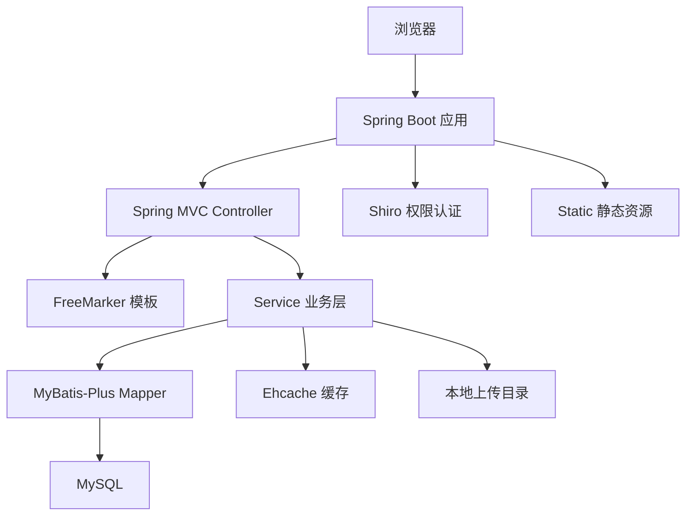
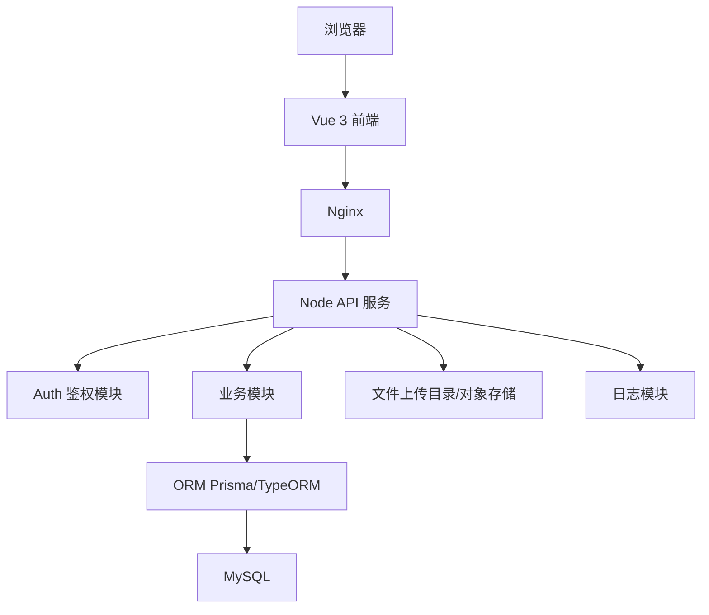

# yun-blog 项目说明与重构评估

## 1. 项目概览

`yun-blog` 当前是一个基于 **Spring Boot 2.7.x + FreeMarker + MyBatis-Plus + Apache Shiro + MySQL** 的传统 Java Web 项目。

项目并不是典型的纯博客系统，而更像一个带后台管理能力的导航/内容管理系统，包含：

- 登录、注册、验证码、退出登录
- 用户、角色、菜单、权限管理
- 部门管理
- 分类管理
- 站点/导航管理
- 模板管理
- 通知管理
- 操作日志
- 员工信息导入/维护
- 前台导航页 `/guide`
- 基于 Shiro 的会话认证与权限控制
- 基于 FreeMarker 的服务端页面渲染
- Layui/jQuery 静态页面交互

当前访问上下文路径为：

```properties
server.servlet.context-path=/yunBase
server.port=8050
```

本地启动后理论访问地址：

```text
http://localhost:8050/yunBase
```

---

## 2. 当前技术栈

### 后端

| 类型 | 当前技术 |
|---|---|
| 语言 | Java 8 |
| 框架 | Spring Boot 2.7.15 |
| Web | Spring MVC |
| 模板引擎 | FreeMarker |
| ORM | MyBatis-Plus |
| 数据库 | MySQL 8 驱动 |
| 数据源 | Druid |
| 权限认证 | Apache Shiro |
| 缓存 | Ehcache |
| JSON | Fastjson |
| 工具库 | Hutool、Apache Commons |
| 文件上传 | Spring Multipart + 本地文件目录 |
| Excel | EasyExcel、Apache POI |
| 日志 | Logback |
| 构建 | Maven |

### 前端

| 类型 | 当前技术 |
|---|---|
| 页面渲染 | FreeMarker `.ftl` |
| UI 组件 | Layui |
| DOM/Ajax | jQuery |
| 静态资源 | `src/main/resources/static` |
| 页面模板 | `src/main/resources/templates` |

---

## 3. 项目目录结构

```text
yun-blog/
├── pom.xml                         # Maven 依赖与构建配置
├── assembly.xml                    # 打包分发配置，生成 tar.gz/dir
├── db/
│   └── blog.rar                    # 数据库备份/压缩包，需解压确认 SQL 内容
├── script/
│   ├── run.sh                      # Linux 启动脚本
│   ├── stop.sh                     # Linux 停止脚本
│   └── start.bat                   # Windows 启动脚本
├── src/main/java/com/yun/yunblog/
│   ├── YunBlogApplication.java     # Spring Boot 启动入口
│   ├── blog/                       # 核心业务模块
│   ├── common/                     # 通用工具
│   ├── core/                       # 通用响应、异常、注解、基础实体
│   ├── coreweb/                    # Web 配置、安全、拦截器、异常处理等
│   └── factory/                    # 交易处理示例/扩展模块
├── src/main/resources/
│   ├── application.properties      # 通用配置
│   ├── application-dev.properties  # 开发环境配置
│   ├── application-test.properties # 测试环境配置
│   ├── ehcache.xml                 # Ehcache 配置
│   ├── logback-spring.xml          # 日志配置
│   ├── static/                     # CSS、JS、图片、Layui、jQuery 等静态资源
│   └── templates/                  # FreeMarker 页面模板
└── target/                         # Maven 构建产物
```

---

## 4. 后端分层说明

### 4.1 启动入口

- `src/main/java/com/yun/yunblog/YunBlogApplication.java`

主要职责：

- 启动 Spring Boot 应用
- 开启缓存：`@EnableCaching`
- 启动完成后打印访问地址

### 4.2 业务模块：`blog`

路径：`src/main/java/com/yun/yunblog/blog`

```text
blog/
├── aspect/       # 业务日志注解与 AOP
├── constant/     # 常量枚举
├── controller/   # Spring MVC 控制器
├── entity/       # 数据库实体/页面 DTO
├── listener/     # Excel 上传监听器
├── mapper/       # MyBatis-Plus Mapper
└── service/      # 业务服务层
```

主要业务控制器：

| 控制器 | 职责 |
|---|---|
| `LoginController` | 登录、注册、验证码 |
| `IndexController` | 首页、退出、菜单、个人信息、导航页 |
| `UserController` | 用户管理 |
| `RoleController` | 角色管理、授权 |
| `MenuController` | 菜单管理 |
| `DeptController` | 部门管理 |
| `CategoryController` | 分类管理 |
| `SiteController` | 站点/导航管理 |
| `TmlController` | 模板管理 |
| `NotifyController` | 通知管理 |
| `OperateLogController` | 操作日志 |
| `WorkerInfoController` | 员工信息管理/上传 |
| `CommonController` | 通用上传/下载等能力 |

主要实体：

| 实体 | 含义 |
|---|---|
| `User` | 用户基础信息 |
| `UserIdentity` | 用户登录身份、账号、密码、状态等 |
| `Role` | 角色 |
| `Menu` | 菜单/权限 |
| `RoleMenu` | 角色菜单关系 |
| `UserRole` | 用户角色关系 |
| `Dept` | 部门 |
| `Category` | 导航分类 |
| `Site` | 站点 |
| `Tml` | 模板 |
| `Notify` / `NotifyUser` | 通知及通知用户关系 |
| `OperateLog` | 操作日志 |
| `WorkerInfo` | 员工信息 |

### 4.3 通用核心模块：`core`

路径：`src/main/java/com/yun/yunblog/core`

包含：

- `Result`、`ResultGrid`：统一响应结构
- `PageInfo`：分页信息
- `BaseEntity`：基础实体
- `SystemException` 等异常
- `FormToken`：表单重复提交控制注解
- `GlobalStatic`、`FileChecker` 等工具/常量

### 4.4 Web 基础设施：`coreweb`

路径：`src/main/java/com/yun/yunblog/coreweb`

包含：

- Spring MVC 配置
- MyBatis-Plus 配置
- FreeMarker 配置
- Shiro 自动配置
- 自定义权限过滤器
- 表单 Token 拦截器
- XSS 过滤
- 全局异常处理
- Fastjson 消息转换器
- 文件导出工具

重点文件：

| 文件 | 作用 |
|---|---|
| `ShiroUserTokenAutoConfiguration.java` | Shiro 安全配置、URL 拦截规则、Session 配置 |
| `ShiroRealm.java` | 登录认证和权限授权逻辑 |
| `ShiroFilter.java` | 未登录处理、Ajax 未授权响应 |
| `FormTokenInterceptor.java` | 表单重复提交控制 |
| `CustomExceptionHandler.java` | 全局异常处理 |
| `WebMvcConfiguration.java` / `MyWebMvcConfigurationSupport.java` | Web MVC 相关配置 |

### 4.5 `factory` 模块

路径：`src/main/java/com/yun/yunblog/factory`

该模块看起来是一个交易处理/工厂模式示例或独立扩展功能，包含：

- `TransactionController`
- `TransactionService`
- `TransactionProcessorFactory`
- 不同交易类型处理器
- 限流 AOP：`TransactionRateLimitAspect`

从命名看，它与博客/导航主营业务关联不强，后续重构时可以评估是否保留、拆分或删除。

---

## 5. 页面与静态资源

### 5.1 FreeMarker 模板

路径：`src/main/resources/templates`

```text
templates/
├── index/        # 登录、首页、错误页、个人信息、修改密码
├── guide/        # 前台导航页
├── user/         # 用户管理页面
├── role/         # 角色管理页面
├── menu/         # 菜单管理页面
├── dept/         # 部门管理页面
├── category/     # 分类管理页面
├── site/         # 站点管理页面
├── tml/          # 模板管理页面
├── operateLog/   # 操作日志页面
├── workerInfo/   # 员工信息页面
├── css.ftl
├── javascript.ftl
└── meta.ftl
```

说明：当前页面是服务端渲染模式，Controller 返回模板名称，例如：

```java
@GetMapping("/user/list")
public String list() {
    return "user/list";
}
```

列表数据则通常通过 Ajax 请求获取，例如：

```java
@PostMapping(value = "/list/data")
public ResultGrid<List<UserIdentity>> findListData(...) {
    ...
}
```

这说明项目已经有部分接口化基础，但页面路由与模板渲染仍然绑定在 Java 后端中。

### 5.2 静态资源

路径：`src/main/resources/static`

包含：

- `layui/`
- `jquery-3.4.1/`
- `js/`
- `css/`
- `images/`
- `fonts/`

当前前端交互大概率是：

```text
FreeMarker 页面 + Layui 表格/表单 + jQuery Ajax + Spring MVC 接口
```

---

## 6. 数据库与配置

### 6.1 数据库

当前项目使用 MySQL。

开发环境配置文件：

- `src/main/resources/application-dev.properties`

当前配置中直接写入了数据库连接地址、账号和密码。注意：这是安全风险，建议尽快改为环境变量或外部配置文件，不要把真实密码提交到代码仓库。

建议改造为：

```properties
spring.datasource.url=${DB_URL}
spring.datasource.username=${DB_USERNAME}
spring.datasource.password=${DB_PASSWORD}
```

### 6.2 数据库脚本

当前 `db/` 目录下只有：

```text
db/blog.rar
```

需要解压后确认：

- 表结构 SQL
- 初始数据 SQL
- 是否包含生产数据
- 字段命名是否与实体保持一致

### 6.3 MyBatis-Plus

配置中：

```properties
mybatis-plus.mapper-locations=classpath*:mybatis/*.xml
```

但当前资源目录未发现 `src/main/resources/mybatis/*.xml`，说明项目大部分 SQL 可能使用：

- MyBatis-Plus BaseMapper 通用 CRUD
- Mapper 注解 SQL，例如 `@Select`
- 少量自定义 Mapper 方法，需逐一确认是否存在 XML 缺失问题

---

## 7. 权限认证现状

当前使用 Apache Shiro。

主要特点：

- 基于 Session 的登录态
- URL 拦截规则集中在 `ShiroUserTokenAutoConfiguration.java`
- 登录页、注册页、验证码、静态资源匿名访问
- 后台大部分页面需要登录及权限
- 部分接口使用 `user` 或自定义 `e-perms` 过滤器
- Session 使用 `MemorySessionDAO`，服务重启后会话丢失，不适合多实例部署

当前 Shiro 拦截规则示例：

```java
filterMap.put("/login", "anon");
filterMap.put("/guide", "anon");
filterMap.put("/static/**", "anon");
filterMap.put("/main", "user");
filterMap.put("/**", "authc,e-perms");
```

如果迁移到 Vue + Node，需要重新设计：

- 登录态机制：JWT / Session / Redis Session
- 权限模型：用户-角色-菜单-权限
- 菜单接口：前端动态路由或动态菜单
- 按钮级权限：前端控制 + 后端接口鉴权

---

## 8. 当前架构图



---

## 9. 是否适合重构为 Vue + Node + MySQL

### 结论

**可行，但不是简单替换技术栈；它本质上是一次前后端分离重构。**

如果目标是：

- 前端开发体验更好
- 页面交互更现代
- 降低 Java/Spring/Shiro 的学习和运维门槛
- 部署一个轻量后台服务
- 后续做移动端、小程序或开放 API

那么重构为 `Vue + Node + MySQL` 是可行的。

但如果只是为了“更轻量”，需要谨慎：

- Node 服务本身可能比 Spring Boot 启动更轻、内存更低
- 但 Vue + Node 会拆成前端和后端两个工程，工程数量和接口联调复杂度会上升
- 原有 Shiro 权限、FreeMarker 页面、Layui 交互都需要迁移或重写
- 不是把 Java 改成 Node 就自动更简单，关键取决于重构范围和选型

---

## 10. 轻量级对比

### 10.1 当前 Spring Boot 模式

优点：

- 一个应用包即可部署
- 后端、页面、静态资源集中管理
- Shiro、MyBatis-Plus、事务、AOP 等能力成熟
- 当前代码已经基本成型，迁移成本低

缺点：

- Java/Spring/Shiro 配置偏重
- FreeMarker + Layui 页面维护体验较旧
- 前端工程化能力弱
- 服务端渲染与接口混在一起，后续扩展移动端/API 不够方便
- 当前启动脚本 JVM 参数固定 `-Xms1024m -Xmx1024m`，运行内存占用偏高，可优化

### 10.2 Vue + Node + MySQL 模式

推荐组合：

| 层 | 建议技术 |
|---|---|
| 前端 | Vue 3 + Vite + TypeScript |
| UI | Element Plus / Naive UI / Ant Design Vue |
| 路由 | Vue Router |
| 状态管理 | Pinia |
| 请求 | Axios |
| 后端 | NestJS 或 Express/Fastify |
| ORM | Prisma / TypeORM / Sequelize |
| 数据库 | MySQL |
| 登录 | JWT + Refresh Token，或 Session + Redis |
| 部署 | Nginx + Node PM2/Docker |

优点：

- 前端体验和页面维护明显更好
- 后端接口化，适合多端复用
- Node 服务启动快，基础内存通常较低
- 对中小型后台系统可以更轻快
- Vite 构建和热更新效率高

缺点：

- 需要重写 FreeMarker 页面
- 需要重写或迁移全部 Controller/Service/Mapper 逻辑
- 权限体系需要重新实现
- 文件上传、Excel 导入、操作日志、XSS、防重复提交等能力都要重建
- 分成前后端两个项目后，部署链路变长

---

## 11. 哪种情况下建议重构

### 建议重构的情况

如果你有以下目标，建议重构：

1. 想长期维护这个项目，而不是只做小改小补
2. 想把后台 UI 升级成现代化管理系统
3. 想把 `/guide` 前台导航页做得更丰富、更好看
4. 想提供 API 给移动端、小程序或其他系统
5. 团队更熟悉 JavaScript/TypeScript，而不是 Java/Spring
6. 当前功能不算庞大，可以接受阶段性重写

### 不建议立即全量重构的情况

如果你只是想：

1. 尽快上线
2. 修一些小功能
3. 降低服务器内存
4. 保持现有页面不大变

那不建议立刻全量重构。可以先做轻量优化：

- 降低 JVM 内存参数，例如从 `-Xmx1024m` 改到 `-Xmx256m` 或 `-Xmx512m` 观察
- 移除不用的依赖
- 把敏感配置外置
- 优化静态资源和模板
- 将部分 Controller 改成 REST API，为后续 Vue 做准备

---

## 12. 推荐重构路线

建议不要一次性推倒重写，推荐渐进式迁移。

### 阶段 1：整理数据模型和接口

目标：保留 Java 后端，先把接口规范梳理出来。

工作：

- 解压 `db/blog.rar`，整理表结构
- 梳理实体与表关系
- 统一接口响应结构
- 把现有页面接口和模板跳转接口区分开
- 明确哪些接口需要登录、哪些需要权限

输出：

- 数据库 ER 图
- API 文档
- 权限点清单

### 阶段 2：先做 Vue 前端，复用 Java 后端

目标：降低风险，先前后端分离。

做法：

- 新建 `frontend/` Vue 3 项目
- Java 后端逐步增加 `/api/**` REST 接口
- Vue 通过接口获取数据
- 旧 FreeMarker 页面暂时保留
- 一个模块一个模块替换，例如先替换登录、菜单、用户管理

优点：

- 后端业务逻辑不用马上重写
- 可以边跑旧系统边迁移新页面
- 出问题可回退

### 阶段 3：评估是否将 Java 后端替换为 Node

当前端迁移完成后，再决定是否需要 Node。

如果 Java 后端运行稳定、资源可接受，可以保留 Java 后端。此时架构是：

```text
Vue + Spring Boot + MySQL
```

这其实是企业项目里非常常见且稳定的组合。

如果仍想统一到 JS/TS 技术栈，再将 Service/Mapper 迁移到 Node。

### 阶段 4：Node 后端重写

建议使用 NestJS，而不是裸 Express。

原因：

- 模块化结构更接近 Spring Boot
- Controller / Service / Guard / Interceptor 概念清晰
- 更适合迁移当前这种后台管理系统
- TypeScript 类型约束更强

推荐目录：

```text
backend/
├── src/
│   ├── main.ts
│   ├── app.module.ts
│   ├── common/
│   │   ├── filters/
│   │   ├── guards/
│   │   ├── interceptors/
│   │   └── dto/
│   ├── auth/
│   ├── user/
│   ├── role/
│   ├── menu/
│   ├── dept/
│   ├── category/
│   ├── site/
│   ├── notify/
│   ├── operate-log/
│   └── worker-info/
├── prisma/
│   └── schema.prisma
└── package.json
```

---

## 13. 建议的新架构



如果要更轻量，可以简化为：

```text
Vue 3 + Vite + Express/Fastify + Prisma + MySQL
```

如果要更规范、方便长期维护：

```text
Vue 3 + Vite + NestJS + Prisma + MySQL
```

---

## 14. 迁移模块优先级建议

建议按风险从低到高迁移：

1. 登录页 UI、验证码展示
2. `/guide` 前台导航页
3. 菜单列表接口
4. 分类管理
5. 站点管理
6. 用户管理
7. 角色/权限管理
8. 部门管理
9. 通知管理
10. 操作日志
11. 员工信息上传/Excel 导入
12. 文件上传/下载
13. 全局安全、限流、XSS、防重复提交

原因：

- 导航、分类、站点相对独立，适合先迁移
- 用户、角色、权限影响全局，建议中后期迁移
- Excel、文件、安全类功能细节多，放后面处理

---

## 15. 当前项目需要立即注意的问题

### 15.1 数据库密码泄露风险

`application-dev.properties` 中存在明文数据库地址、账号和密码。建议立即：

- 修改数据库密码
- 改为环境变量读取
- 确认 Git 历史中是否已提交过敏感信息
- 如已提交到远程仓库，视情况清理历史或轮换凭证

### 15.2 密码安全较弱

当前代码中可见 MD5 相关逻辑，且 Shiro `HashedCredentialsMatcher` 配置中使用 MD5，但实际 matcher 似乎被注释未启用：

```java
//shiroRealm.setCredentialsMatcher(matcher);
```

建议后续改为：

- BCrypt / Argon2
- 每个用户独立 salt
- 密码策略和登录失败锁定策略统一实现

### 15.3 Session 存储在内存

当前使用：

```java
new MemorySessionDAO()
```

问题：

- 应用重启登录态丢失
- 不支持多实例共享 Session

如继续使用 Java，建议改为 Redis Session。

如迁移 Node，建议使用：

- JWT + Refresh Token
- 或 Session + Redis

### 15.4 打包脚本 JVM 内存偏高

`script/run.sh` 中固定：

```sh
-Xms1024m -Xmx1024m
```

如果服务器资源较小，可考虑调低，例如：

```sh
-Xms128m -Xmx512m
```

是否可行需要结合实际访问量测试。

---

## 16. 最终建议

### 如果你的核心目标是“更轻量”

不一定要马上换成 Node。可以先做：

1. 降低 JVM 内存参数
2. 外置敏感配置
3. 删除无用依赖和 `factory` 示例模块
4. 保留 Spring Boot，新增 Vue 前端
5. 将页面逐步接口化

推荐架构：

```text
Vue 3 + Spring Boot + MySQL
```

这是低风险方案。

### 如果你的核心目标是“技术栈统一、前后端分离、长期重做”

可以重构为：

```text
Vue 3 + NestJS + Prisma + MySQL
```

这是更现代、更前后端分离的方案，但迁移成本更高。

### 是否更轻量？

结论分两层：

- **运行资源层面**：Node 通常可以比当前 Spring Boot + 1G JVM 参数更轻。
- **工程复杂度层面**：Vue + Node 会变成前后端两个工程，并不一定比当前单体项目更简单。

因此，最稳妥的路线是：

```text
先 Vue 化前端，保留 Java 后端；等接口稳定后，再决定是否迁移 Node。
```
